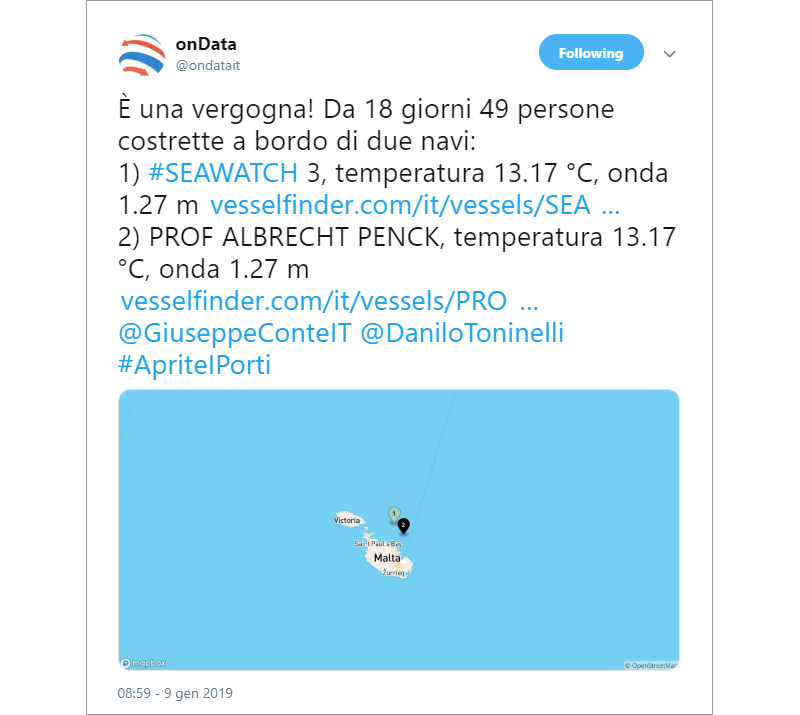

<!-- TOC -->

- [Versione corrente (2019-01-20)](#versione-corrente-2019-01-20)
    - [Un tweet periodico per seguire la nave "SEA WATCH 3"](#un-tweet-periodico-per-seguire-la-nave-sea-watch-3)
- [Vecchia versione](#vecchia-versione)
    - [Un tweet periodico per seguire le navi "SEA WATCH 3" e "PROF ALBRECHT PENCK", a partire dai dati](#un-tweet-periodico-per-seguire-le-navi-sea-watch-3-e-prof-albrecht-penck-a-partire-dai-dati)

<!-- /TOC -->
# Versione corrente (2019-01-20)

## Un tweet periodico per seguire la nave "SEA WATCH 3"

Il [19 gennaio 2019](https://twitter.com/SeaWatchItaly/status/1086624727874056192) l'equipaggio della "SEA WATCH 3" ha salvato 47 persone dal mare.

Alle 8, alle 15 e alle 22 verrà pubblicato un tweet simile a quello di [sotto](https://twitter.com/ondatait/status/1082909680681259008). È generato automaticamente a partire dalla **raccolta** di alcuni **dati** (al momento della pubblicazione del tweet):

- quanti **giorni** sono **passati** a partire dal 19 gennaio 2019;
- le **coordinate** della nave (grazie a https://www.vesselfinder.com) e a partire da queste;
  - **temperatura** e **altezza d'onda** (grazie a https://stormglass.io);
  - un'**immagine** con la **mappa** con la posizione della nave (grazie a [Mapbox](https://www.mapbox.com/api-documentation/#static) e [OpenStreetMap](https://www.openstreetmap.org/))

# Vecchia versione

## Un tweet periodico per seguire le navi "SEA WATCH 3" e "PROF ALBRECHT PENCK", a partire dai dati

Alle 8, alle 13, alle 18 e alle 22 verrà pubblicato un tweet come quello di [sotto](https://twitter.com/ondatait/status/1082909680681259008). È generato automaticamente a partire dalla **raccolta** di alcuni **dati** (al momento della pubblicazione del tweet):

- quanti **giorni** sono **passati** a partire dal 22 dicembre (il giorno in cui la "SEA WATCH 3" ha preso a bordo le persone);
- le **coordinate** delle navi (grazie a https://www.vesselfinder.com) e a partire da queste;
  - **temperatura** e **altezza d'onda** (grazie a https://stormglass.io);
  - un'**immagine** con la **mappa** con la posizione delle navi (grazie a [Mapbox](https://www.mapbox.com/api-documentation/#static) e [OpenStreetMap](https://www.openstreetmap.org/))

